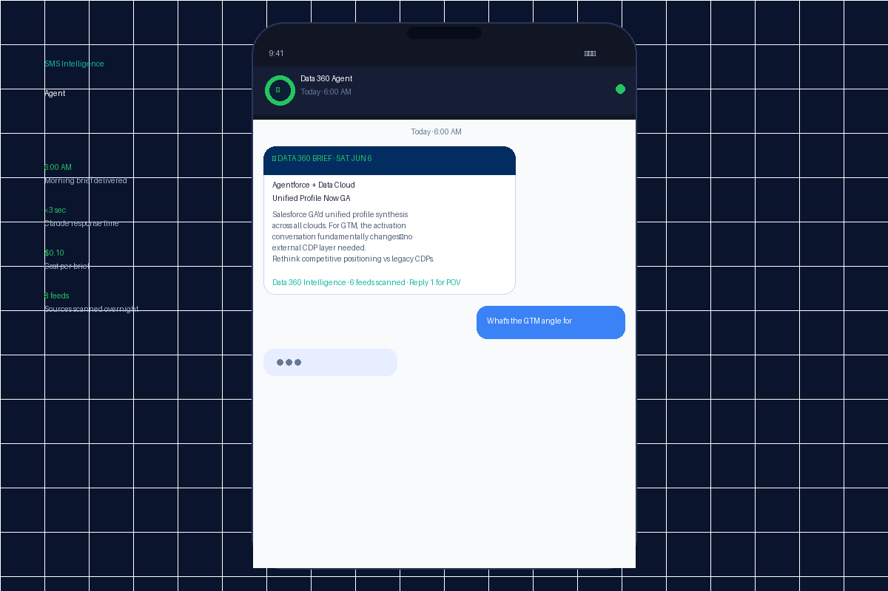
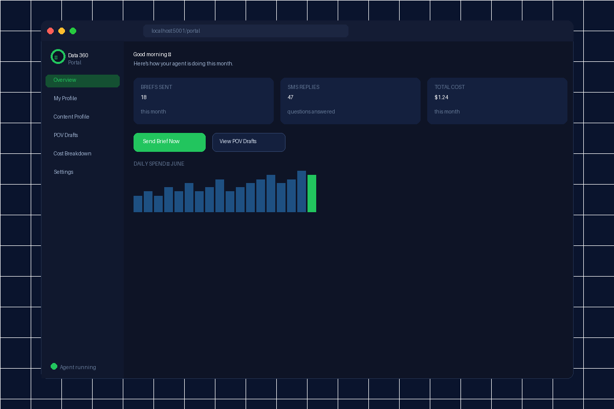

# Hi, I'm Thomas Jepson 👋

**GTM Leader · Salesforce Data Cloud · AI Builder**

I work at the intersection of enterprise go-to-market strategy and applied AI — helping Salesforce Data Cloud teams move faster, know more, and win deals. Currently building AI agents that make GTM teams sharper, not just busier.

---

## 🤖 What I'm Building

### [Data 360 GTM Intelligence Agent](https://github.com/thomasjepson-arch/SMS_Agent)
An AI-powered SMS agent for Salesforce Data Cloud GTM teams. It monitors 8 industry sources overnight, synthesises the single most relevant Data Cloud development, and delivers a curated brief to your phone at 6am — every morning, automatically.

- **Reply "1"** to any brief → Claude generates a publish-ready thought leadership blog post in your voice
- **Ask anything** via SMS → contextual answers with your role and competitive landscape baked in
- **Local portal** → PIN-protected dashboard for costs, drafts, and personalisation
- **Always on** → runs as a macOS background service, zero maintenance

**Stack:** Python · Flask · Anthropic Claude · Twilio · macOS launchd · ngrok

### 📸 In Action

  
  &nbsp;&nbsp;
  

---

## 🛠 Tech I Work With

---

## 📌 Focus Areas

- **Salesforce Data Cloud** — GTM strategy, competitive positioning, customer data platform architecture
- **AI-powered productivity** — building personal agents that eliminate the grunt work of staying sharp
- **Thought leadership** — turning platform developments into narratives that win deals

---

## 📫 Connect

---

*"The best GTM teams don't read faster — they have better tools."*
